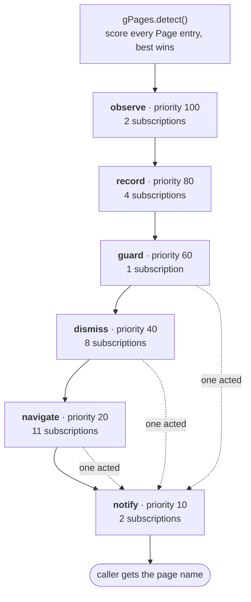
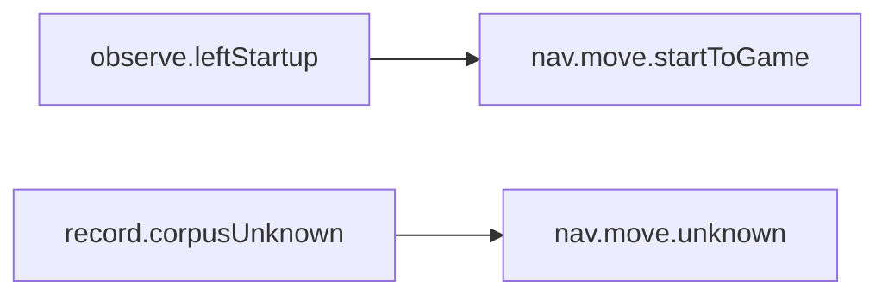
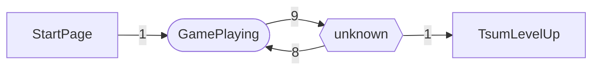

# Page dispatch

<!-- Generated by `npm run pages:docs`. Do not edit: every number below is
     read out of the built bundle, so a change here is lost on the next build
     and a change in `src/pageHandlers.ts` shows up here on its own. -->

What the script does when it works out which screen is on display.

`gPages` (src/pages.ts) detects the page, then broadcasts it to the
subscriptions registered in `src/pageHandlers.ts`. They run one at a time, in
the order below, and **the first one to touch the screen ends the round** --
everything after it would be acting on a frame that no longer exists.

A subscription is a list of steps rather than a function body, so the **steps**
column below is the whole of what it does: which button, which wait, in what
order. `settle` is a ceiling and not a cost -- it ends when the screen stops
moving -- where `sleep` is spent in full, and is only used where there is no
still frame to wait for.

`28` subscriptions, `44` pages, `6` navigation destinations.

## The pipeline

The first subscription to touch the screen ends the queue, and everything below
it is skipped -- it would be reading a frame that no longer exists. Which ones
touch it is the band's answer rather than each one's: **guard**, **dismiss**
and **navigate** act unless their `acts` declined. **notify** is the exception
and runs either way: it records what was seen rather than acting on what is
there.

| band | priority | subscriptions | purpose |
|---|---|---|---|
| **observe** | 100 | 2 | Read-only state updates derived from the page itself. No taps and no expensive captures -- these describe the frame the recorders are about to measure, and they are the only band guaranteed to run whatever else the queue decides. |
| **record** | 80 | 4 | Measurements and captures that are only valid while the screen is untouched: round statistics, corpus frames, debug shots. Everything below this line may tap. |
| **guard** | 60 | 1 | Anything that is not a game screen at all (native dialogs, the root warning) is handled here, before the rest of the queue is allowed to act on what it sees. |
| **dismiss** | 40 | 8 | Close the interruptions that stand between the script and where it is going -- offers, popups, error panels. |
| **navigate** | 20 | 11 | Move the app toward the goal the look was made with. Silent when the caller gave none -- every look outside navigate() -- and never on the goal page itself, so nothing can tap the script off its destination. |
| **notify** | 10 | 2 | Logging and progress bookkeeping. Nothing here changes what is on screen or what anything else decides -- which is why this band runs even when something above it has acted: it is recording what was seen, not acting on it. |

Within a band the order is `order` descending, then registration order, then a
topological pass over `after`. A dependency that names a subscription which is
not in the same queue is satisfied vacuously: it did not run, and it was never
going to.

## Every subscription, in dispatch order

| # | id | band | steps | order | pages | goals | fires | after |
|---|---|---|---|---|---|---|---|---|
| 1 | `observe.startupPhase` | observe | `enterStartupPhase()` | 0 | `RootDetection` | — | every look | — |
| 2 | `observe.leftStartup` | observe | `leaveStartupPhase()` | 0 | `GamePlaying`, `GamePause`, `StartPage`, `TsumsPage`, `TsumTsumStorePage` | — | every look | — |
| 3 | `record.feverTime` | record | `gFever.update()` | 0 | `GamePlaying`, `GamePause`, `ScorePage`, `HighScore`, `TsumLevelUp`, `AccountLevelUp`, `EventMain`, `EventCardReveal`, `EventGift`, `MagicalTime`, `StartPage`, `FriendPage`, `FriendInfo`, `ProfilePage`, `SquarePage`, `ClosePage`, `TapOpenPage`, `TapOpenPageDeprecated`, `TsumsPage`, `TsumSortOrder`, `RaiseLevelCap`, `LevelCapRaised`, `TsumTsumStorePage`, `ConfirmPurchasePage`, `BoxPurchasedPage`, `BoxPurchaseResult`, `NotEnoughCoins`, `OutOfMedals`, `RubyResetDifficulty`, `MailBox`, `Received`, `ReceiveHeart`, `ReceiveHeartWithoutCoins`, `ReceiveSkillTicket`, `ReceivePremiumTicket`, `GiftHeart`, `HeartSent`, `TodayMission`, `TodayMissions`, `RootDetection`, `NetworkDisable`, `NetworkTimeout`, `ExtraUpdate`, `unknown` | — | every look | — |
| 4 | `record.corpusUnknown` | record | `saveCorpusFrame()` | 0 | `unknown` | — | on arrival | — |
| 5 | `record.baseCoins` | record | `sampleBaseCoins()` | 0 | `TsumLevelUp` | — | every look | — |
| 6 | `record.myTsum` | record | `identifyMyTsum()` | 0 | `StartPage` | — | on arrival | — |
| 7 | `guard.rootDetection` | guard | `dismissSystemDialog()` | 0 | `RootDetection` | — | every look | — |
| 8 | `dismiss.magicalTime` | dismiss | log `play.magicalTimeCancelled` → tap `back` → sleep 500ms | 0 | `MagicalTime` | — | every look | — |
| 9 | `dismiss.highScore` | dismiss | log `page.highScore.closing` → tap `back` → settle 2000ms | 0 | `HighScore` | — | every look | — |
| 10 | `dismiss.accountLevelUp` | dismiss | log `page.accountLevelUp.closing` → tap `back` → settle 2000ms | 0 | `AccountLevelUp` | — | every look | — |
| 11 | `dismiss.eventMain` | dismiss | log `page.eventMain.closing` → tap `back` → settle 2000ms | 0 | `EventMain` | — | every look | — |
| 12 | `dismiss.eventCardReveal` | dismiss | log `page.eventCardReveal.closing` → tap `back` → settle 2000ms | 0 | `EventCardReveal` | — | every look | — |
| 13 | `dismiss.eventGift` | dismiss | log `page.eventGift.closing` → tap `back` → settle 2000ms | 0 | `EventGift` | — | every look | — |
| 14 | `dismiss.notEnoughCoins` | dismiss | log `box.noCoins` → tap `back` → settle 2000ms | 0 | `NotEnoughCoins` | — | every look | — |
| 15 | `dismiss.resumeGame` | dismiss | log `page.gamePause.resuming` → tap `next` → sleep 500ms | 0 | `GamePause` | — | every look | — |
| 16 | `nav.wait.transient` | navigate | wait the page out | 100 | `TsumLevelUp` | _any_ | every look | — |
| 17 | `nav.move.tallyToGame` | navigate | `markTallyPlayPressed()` → tap `next` → settle 3000ms | 60 | `ScorePage` | GamePlaying | every look | — |
| 18 | `nav.move.friendToGame` | navigate | tap `next` → settle 3000ms | 60 | `FriendPage` | GamePlaying | every look | — |
| 19 | `nav.move.startToGame` | navigate | settle 1500ms → `checkGameItem()` → `openRound()` → tap `Button.outStart` → `awaitRoundStart()` | 60 | `StartPage` | GamePlaying | every look | `observe.leftStartup` |
| 20 | `nav.move.toTsums` | navigate | tap `tsums` → settle 3000ms | 60 | `ProfilePage`, `FriendPage`, `StartPage` | TsumsPage | every look | — |
| 21 | `nav.move.toMail` | navigate | tap `mail` → settle 3000ms | 60 | `FriendPage` | MailBox | every look | — |
| 22 | `nav.move.toHome` | navigate | tap `home` → settle 3000ms | 60 | `SquarePage`, `FriendPage` | ProfilePage | every look | — |
| 23 | `nav.move.toStore` | navigate | tap `store` → settle 3000ms | 60 | `TsumsPage` | TsumTsumStorePage | every look | — |
| 24 | `nav.move.closePage` | navigate | tap `back` → tap (310, 1448) → settle 1500ms | 40 | `ClosePage` | _any_ | every look | — |
| 25 | `nav.move.unknown` | navigate | `exitUnknownPage()` | 30 | `unknown` | _any_ | every look | `record.corpusUnknown` |
| 26 | `nav.move.exit` | navigate | tap `back` → settle 1500ms | 0 | `StartPage`, `GamePlaying`, `GamePause`, `MagicalTime`, `HighScore`, `AccountLevelUp`, `EventMain`, `EventCardReveal`, `EventGift`, `TsumLevelUp`, `ScorePage`, `TsumSortOrder`, `RaiseLevelCap`, `LevelCapRaised`, `TsumTsumStorePage`, `ConfirmPurchasePage`, `BoxPurchasedPage`, `BoxPurchaseResult`, `TsumsPage`, `ProfilePage`, `SquarePage`, `MailBox`, `Received`, `ReceiveHeart`, `ReceiveSkillTicket`, `ReceivePremiumTicket`, `GiftHeart`, `HeartSent`, `FriendInfo`, `TodayMission`, `TodayMissions`, `TapOpenPage`, `TapOpenPageDeprecated`, `OutOfMedals`, `RubyResetDifficulty`, `ExtraUpdate`, `NetworkDisable`, `NetworkTimeout` | _any_ | every look | — |
| 27 | `notify.trail` | notify | `gPages.trail()` | 0 | `GamePlaying`, `GamePause`, `ScorePage`, `HighScore`, `TsumLevelUp`, `AccountLevelUp`, `EventMain`, `EventCardReveal`, `EventGift`, `MagicalTime`, `StartPage`, `FriendPage`, `FriendInfo`, `ProfilePage`, `SquarePage`, `ClosePage`, `TapOpenPage`, `TapOpenPageDeprecated`, `TsumsPage`, `TsumSortOrder`, `RaiseLevelCap`, `LevelCapRaised`, `TsumTsumStorePage`, `ConfirmPurchasePage`, `BoxPurchasedPage`, `BoxPurchaseResult`, `NotEnoughCoins`, `OutOfMedals`, `RubyResetDifficulty`, `MailBox`, `Received`, `ReceiveHeart`, `ReceiveHeartWithoutCoins`, `ReceiveSkillTicket`, `ReceivePremiumTicket`, `GiftHeart`, `HeartSent`, `TodayMission`, `TodayMissions`, `RootDetection`, `NetworkDisable`, `NetworkTimeout`, `ExtraUpdate`, `unknown` | — | on arrival | — |
| 28 | `notify.forecast` | notify | `forecastEmit()` | 0 | `GamePlaying`, `GamePause`, `ScorePage`, `HighScore`, `TsumLevelUp`, `AccountLevelUp`, `EventMain`, `EventCardReveal`, `EventGift`, `MagicalTime`, `StartPage`, `FriendPage`, `FriendInfo`, `ProfilePage`, `SquarePage`, `ClosePage`, `TapOpenPage`, `TapOpenPageDeprecated`, `TsumsPage`, `TsumSortOrder`, `RaiseLevelCap`, `LevelCapRaised`, `TsumTsumStorePage`, `ConfirmPurchasePage`, `BoxPurchasedPage`, `BoxPurchaseResult`, `NotEnoughCoins`, `OutOfMedals`, `RubyResetDifficulty`, `MailBox`, `Received`, `ReceiveHeart`, `ReceiveHeartWithoutCoins`, `ReceiveSkillTicket`, `ReceivePremiumTicket`, `GiftHeart`, `HeartSent`, `TodayMission`, `TodayMissions`, `RootDetection`, `NetworkDisable`, `NetworkTimeout`, `ExtraUpdate`, `unknown` | — | every look | — |

### What each one is for

- **`observe.startupPhase`** — The root warning means the game is coming up (or has just been restarted), so the navigation loops go back to their slower startup timings.
- **`observe.leftStartup`** — Any of the screens that only exist once the game is fully up ends the startup phase, which is what stops the navigation loops from waiting five seconds a round for event windows that are no longer arriving.
- **`record.feverTime`** — Keep the fever state up to date, and broadcast a fever starting or ending. A fever is a mode of the board rather than a screen of its own, so nothing else in this file can report it -- see src/fever.ts.
- **`record.corpusUnknown`** — Keep an unrecognised screen before anything taps it. By definition nothing in the table matched, so this is the single best source of corpus frames -- and the escape below is about to change what is on display.
- **`record.baseCoins`** — Read the in-game coin counter off the level-up screen. The board goes on paying out after the round timer stops, and this is the first screen that is certainly after that -- so it is where the counter first holds the round's figure, and it holds it there for seconds rather than frames.
- **`record.myTsum`** — Read which tsum is selected off the thumbnail in the pre-round screen's lower-right button, so the round about to be played can be attributed to it in the stats CSV and named on the floating banner. Matched against a library rebuilt from the sprite art the game itself ships, so the comparison is against the same drawing rather than a photograph of it.
- **`guard.rootDetection`** — Dismiss the root warning wherever it appears. It is an Android dialog laid out in device pixels, so it is found and pressed structurally; the coordinates recorded for whichever variant matched are passed only as a last-resort hint, because they belong to one emulator and dpi.
- **`dismiss.magicalTime`** — Cancel the offer to play on. OK spends a time ticket and, once those run out, rubies -- and the offer also stands between the round and the score page, so leaving it up costs the round's statistics as well.
- **`dismiss.highScore`** — Close the new-record panel. Like the Magical Time offer it stands between the round and the score page, and it waits for input -- so left alone it holds the tally behind it until whatever is waiting for that gives up.
- **`dismiss.accountLevelUp`** — Close the rank-up panel. The player levelling up drops this over the score tally a moment after the tally appears, and like the new-record panel it waits for input -- so the round's score and coins stay behind it until something presses Close.
- **`dismiss.eventMain`** — Press Close on the event's own page. Tapping the event's result overlay away (waitForScorePage does that blind: the overlay is event art) lands here, one screen further from the score tally the round is waiting to read, and Close is what puts the tally back in front.
- **`dismiss.eventCardReveal`** — Tap the event's card reveal on. It is put up at the event's milestones on the way back to the tally and waits for input; the gift dialog it leads to has a handler of its own.
- **`dismiss.eventGift`** — Press Close on the GET! gift dialog. The game's generic reward dialog, so it is closed wherever it shows, event or not -- the gift itself waits in the mailbox for the mail sweep.
- **`dismiss.notEnoughCoins`** — Cancel the offer to trade Rubies for Coins, wherever it comes up. Nothing in this project may spend the player's Rubies, and the Box Buying sweep is only one of the ways the game can ask -- so the refusal lives here as well as in that flow, and the page's `next` anchor is Cancel too, so no generic mover can press the other button either.
- **`dismiss.resumeGame`** — Press Continue on the game's own pause menu. It stands between the script and the board it was playing, and the script did not necessarily open it: the host presses Pause for the user through `onPause`, so a round comes back from a script pause through here.
- **`nav.wait.transient`** — Sit out a page that dismisses itself rather than tapping it. This is the whole reason pages are classified: a tap aimed at a transient page lands after it has gone, on whatever replaced it.
- **`nav.move.tallyToGame`** — From the score tally, Play opens the pre-round screen directly, saving the hop through the hub between one round and the next. Only when the button can be seen, and only once per tally: a round played in a point battle ends on a tally with one centred Close and no Play, and anything this does not press lands on nav.move.exit below, which closes to the hub as before.
- **`nav.move.friendToGame`** — From the friend hub, Play opens the pre-round screen.
- **`nav.move.startToGame`** — Set the bonus items the settings asked for, open the round, then start it. The round is opened here rather than on the board so `round.start` goes out with the items still in frame -- a recorder listening for it opens on what the round is being played with. The wait afterwards watches the pre-round screen leave and the board arrive, so the next poll neither reads the round fading in as this screen and checks the items all over again, nor sits out a flat five seconds for a board that came up in two.
- **`nav.move.toTsums`** — Any screen carrying a `tsums` anchor has a route straight into the collection, so take it rather than backing out one screen at a time.
- **`nav.move.toMail`** — Any screen carrying a `mail` anchor has the mailbox icon on it, so open the mailbox directly rather than backing out to the hub and hoping.
- **`nav.move.toHome`** — The left rail is on every tab of the hub, so the Home tab is one tap from any of them. The heart sweep goes through here between its two halves: reopening the ranking is what puts our own row back in view.
- **`nav.move.toStore`** — The collection carries the Tsum Tsum Store button, so take it rather than backing out towards it. The Box Buying sweep is what asks for the store, and `NavPlans.TsumTsumStorePage` is what routes it via the collection.
- **`nav.move.closePage`** — The standard close button at centre bottom, plus the second tap that clears the panel some of these screens leave behind.
- **`nav.move.unknown`** — Blind escape from a screen nothing fingerprinted: look for a native dialog first, then work through the cancel and close buttons the game reuses.
- **`nav.move.exit`** — Leave a page by the way it was entered -- its `back` -- where the page declares that as its way out (`PageRoutes`). Last in the band, so anything that knows better has already had its turn. A page with no declared exit is not tapped: `navigate` reports it and the stall guard takes it from there.
- **`notify.trail`** — Log the last few screens with how long each was up, and who claimed this one. Debug only -- this is the history stack in one line, and it is what a report of "it got stuck" is usually missing.
- **`notify.forecast`** — Write what the script is about to do next: which subscription is expected to act on this frame, which task the scheduler runs after this one, and the ways off this screen with where each leads. Debug only and deduplicated -- see src/forecast.ts. It fires on every look rather than only on a change, so a navigation loop tapping the same screen is visible as the loop it is.

## Declared dependencies

These hold in addition to the band order, and outrank it: a subscription waits
for everything it declares, even one in a lower band.

## How each page behaves

Durations are wall-clock at undefinedfps. The game counts these windows in
frames, so `PageRouter.durationOf` scales them by the **Device frame rate**
setting -- the same page is up for half as long at NaNfps.

`roles` is what the page is to the flows (`PageRole`, src/pages.ts): the lists
a flow hands the sweep as `expect` -- what a running round can be looking at,
what the heart sender can -- are read off these, so a page is in every list its
roles put it in and in no other.

| page | kind | roles | at undefinedfps | at NaNfps | source | note |
|---|---|---|---|---|---|---|
| `GamePlaying` | permanent | `board` `gameUp` | — | — | — | The board. It does end on its own when the round timer runs out, but not on a window anything can wait out -- the script plays until the HUD stops fingerprinting, which is what confirmGameOver is for. |
| `GamePause` | permanent | `board` `gameUp` | — | — | — | Pause menu; Continue resumes it. |
| `ScorePage` | permanent | `tally` | — | — | — | Post-round tally. Close and Play both wait; after a point battle it draws Close alone, centred. |
| `HighScore` | permanent | `preTally` | — | — | — | New-record panel with a close button. |
| `TsumLevelUp` | transient | `preTally` | 2900 ms | 1450 ms | **estimate** | The post-round panel listing what each tsum in the party earned -- the one with Close and Share. Not the banner that flashes over the board mid-round, which is an animation rather than a page and has no fingerprint, and not `AccountLevelUp`, which is the player ranking up. |
| `AccountLevelUp` | permanent | `preTally` | — | — | — | The player's own rank going up. It arrives a moment after the score tally and sits on top of it until Close is pressed, so unlike `TsumLevelUp` there is no window to wait out. |
| `MagicalTime` | permanent | `preTally` `interrupt` | — | — | — | The offer to play on for a time ticket, and the one page here that plainly runs a countdown: left alone it cancels itself. The script cancels it anyway (accepting spends tickets and then rubies), so the window is only used to keep the navigation band from tapping into the screen behind it. Ten seconds is the observed order of magnitude, not a timed figure -- see DEVELOPMENT.md on how to measure it. |
| `EventMain` | permanent | `preTally` | — | — | — | The event's own page, reached by tapping the result overlay away. Close is what puts the score tally back in front. |
| `EventCardReveal` | permanent | `preTally` | — | — | — | The event's card reveal, "Tap to Next" -- put up at its milestones on the way to the tally. Waits for input; any tap moves it on. |
| `EventGift` | permanent | `preTally` | — | — | — | The GET! gift dialog ("Claim your gift from your mailbox") with its Close. The game's generic reward dialog; the event raises it after a card reveal. |
| `StartPage` | permanent | `gameUp` | — | — | — | Pre-round screen: items, Start, Tsums. |
| `FriendPage` | permanent | `heartSweep` | — | — | — | The hub the script navigates back to. |
| `FriendInfo` | permanent | `heartSweep` | — | — | — | A friend card, or the settings social panel. |
| `ProfilePage` | permanent | `heartSweep` | — | — | — | The Home tab of the hub -- your own tsum, high score and the daily missions. Named for the profile it shows rather than for the tab; `StartPage` is the pre-round screen, not this. |
| `SquarePage` | permanent | — | — | — | — |  |
| `ClosePage` | permanent | — | — | — | — | Not one screen: a deliberate single-pixel catch-all for anything with the standard close button at centre bottom (events, My Info, settings). |
| `TapOpenPage` | permanent | — | — | — | — | Waits for the "TAP!" it asks for. |
| `TapOpenPageDeprecated` | permanent | — | — | — | — | Older capsule art for the same screen. |
| `TsumsPage` | permanent | `gameUp` | — | — | — |  |
| `TsumSortOrder` | permanent | — | — | — | — | The collection's Change Order dialog; Close is the only exit. |
| `RaiseLevelCap` | permanent | — | — | — | — | Cancel / OK, and OK spends the coins. |
| `LevelCapRaised` | permanent | — | — | — | — | The "level cap has been raised" toast. Like `HeartSent` -- whose sprite it is -- it carries no button and does not clear itself; a tap anywhere is the only way past it. |
| `TsumTsumStorePage` | permanent | `gameUp` | — | — | — |  |
| `ConfirmPurchasePage` | permanent | — | — | — | — | OK / Cancel. |
| `BoxPurchasedPage` | permanent | — | — | — | — | One box's reveal card, with Close. What a 1-Time purchase ends on; a 10-Time one shows ten of these without the Close and then `BoxPurchaseResult`. Also the "You got a Patch!" popup (the `patch` configuration), which a purchase carrying a patch shows after its reveals, with a Close of its own. |
| `BoxPurchaseResult` | permanent | — | — | — | — | The 10-box tally: all ten in a grid, and Close. Only a 10-Time purchase reaches it. |
| `NotEnoughCoins` | permanent | — | — | — | — | Cancel / Buy with Rubies, over whatever asked for the coins. Both anchors are Cancel -- see the `Page` entry. |
| `OutOfMedals` | permanent | — | — | — | — | Two buttons; neither times out. |
| `RubyResetDifficulty` | permanent | — | — | — | — | OK / Cancel. |
| `MailBox` | permanent | — | — | — | — |  |
| `Received` | permanent | `heartSweep` | — | — | — | The received-items panel, with OK. |
| `ReceiveHeart` | permanent | — | — | — | — |  |
| `ReceiveHeartWithoutCoins` | permanent | — | — | — | — |  |
| `ReceiveSkillTicket` | permanent | — | — | — | — |  |
| `ReceivePremiumTicket` | permanent | — | — | — | — |  |
| `GiftHeart` | permanent | `heartSweep` | — | — | — |  |
| `HeartSent` | permanent | `heartSweep` | — | — | — | The "Heart sent!" toast. It carries no button, but it does not clear itself either -- it waits for a tap anywhere, so it is permanent by the definition that matters here: left alone it is still there, and the only way past it is a tap. |
| `TodayMission` | permanent | — | — | — | — |  |
| `TodayMissions` | permanent | — | — | — | — |  |
| `RootDetection` | permanent | `interrupt` | — | — | — | An Android AlertDialog rather than a game screen, and it never goes away by itself -- see dialogs.ts for why it is dismissed structurally instead of by the recorded coordinates. |
| `NetworkDisable` | permanent | `interrupt` | — | — | — | OK button. |
| `NetworkTimeout` | permanent | `interrupt` | — | — | — | OK button. |
| `ExtraUpdate` | permanent | — | — | — | — | OK / Cancel. |
| `unknown` | permanent | — | — | — | — | What the router reports when nothing fingerprinted. Permanent is the safe reading: an unrecognised screen that would have cleared itself costs one wasted escape attempt, where treating a stuck one as transient would wait forever. |

## Navigation destinations

`gPages.navigate(page)` polls until it is there. The navigate band only runs
inside it, and never on the destination itself.

| destination | poll | hold budget | rest | startup wait | via |
|---|---|---|---|---|---|
| `FriendPage` | 2 sweep(s), 1000ms budget | 3000 ms | 1000 ms | 5000 ms | — |
| `GamePlaying` | 2 sweep(s), 2000ms budget | 0 ms | 0 ms | — | — |
| `TsumsPage` | 2 sweep(s), 2000ms budget | 0 ms | 0 ms | — | `FriendPage` |
| `ProfilePage` | 2 sweep(s), 1000ms budget | 1000 ms | 500 ms | — | — |
| `MailBox` | 2 sweep(s), 2000ms budget | 1000 ms | 500 ms | — | `FriendPage` |
| `TsumTsumStorePage` | 2 sweep(s), 2000ms budget | 0 ms | 0 ms | — | `TsumsPage` |

## The sitemap

Which screen has been seen to follow which. **Measured, not declared** --
harvested off a device and accumulated in `docs/transitions.json`. Two
sources feed it: a recorded walkthrough, which carries the taps, and the
page-change frames `PageRouter.saveHistoryShot` leaves behind, which do not.

`4` distinct transition(s) over `4` of `43` pages, from `1` harvest(s), last 2026-08-25.

Hexagons are interruptions, stadiums are `navigate()` destinations, and the
edge labels are how many times the pair has been observed.

`unknown` is not a screen: it is where nothing in the table matched. An edge
through it marks a gap in *detection* rather than a route -- a screen with no
fingerprint, or one obscured while the game animates over it.

**An interruption can follow any page**, which is the reason this graph is a
map and not a filter. `RootDetection` is an Android dialog, and the two network
panels arrive whenever the connection does -- none of them is a successor of
anything in particular. Narrowing detection on a successor set would therefore
have to admit all of them at every node, which is most of what the narrowing
was for. `heartSweepPages()` (`src/pages.ts`, read off the roles each page
declares) is the shape that works instead: a list the one caller that knows its
own context passes in.

| from | to | seen | by tapping | first | last |
|---|---|---|---|---|---|
| `GamePlaying` | `unknown` ⬡ | 9 | — | 2026-08-25 | 2026-08-25 |
| `StartPage` | `GamePlaying` | 1 | — | 2026-08-25 | 2026-08-25 |
| `unknown` ⬡ | `GamePlaying` | 8 | — | 2026-08-25 | 2026-08-25 |
| `unknown` ⬡ | `TsumLevelUp` | 1 | — | 2026-08-25 | 2026-08-25 |

### Not yet observed

Pages the table can recognise that no harvest has caught at either end of a
transition. Absence of evidence: `GamePause`, `ScorePage`, `HighScore`, `AccountLevelUp`, `MagicalTime`, `EventMain`, `EventCardReveal`, `EventGift`, `FriendPage`, `FriendInfo`, `ProfilePage`, `SquarePage`, `ClosePage`, `TapOpenPage`, `TapOpenPageDeprecated`, `TsumsPage`, `TsumSortOrder`, `RaiseLevelCap`, `LevelCapRaised`, `TsumTsumStorePage`, `ConfirmPurchasePage`, `BoxPurchasedPage`, `BoxPurchaseResult`, `NotEnoughCoins`, `OutOfMedals`, `RubyResetDifficulty`, `MailBox`, `Received`, `ReceiveHeart`, `ReceiveHeartWithoutCoins`, `ReceiveSkillTicket`, `ReceivePremiumTicket`, `GiftHeart`, `HeartSent`, `TodayMission`, `TodayMissions`, `RootDetection`, `NetworkDisable`, `NetworkTimeout`, `ExtraUpdate`.

## The queue, page by page

Read a row as "this runs, unless something above it acted first".

### In game

#### `GamePlaying` permanent

| # | subscription | band | when |
|---|---|---|---|
| 1 | `observe.leftStartup` | observe | every look |
| 2 | `record.feverTime` | record | every look |
| 3 | `nav.move.exit` | navigate | every look, any goal |
| 4 | `notify.trail` | notify | on arrival |
| 5 | `notify.forecast` | notify | every look |

On a repeat look at the same page, 4 of these 5 run: the rest fire only when the page changes.

#### `GamePause` permanent

| # | subscription | band | when |
|---|---|---|---|
| 1 | `observe.leftStartup` | observe | every look |
| 2 | `record.feverTime` | record | every look |
| 3 | `dismiss.resumeGame` | dismiss | every look |
| 4 | `nav.move.exit` | navigate | every look, any goal |
| 5 | `notify.trail` | notify | on arrival |
| 6 | `notify.forecast` | notify | every look |

On a repeat look at the same page, 5 of these 6 run: the rest fire only when the page changes.

#### `ScorePage` permanent

| # | subscription | band | when |
|---|---|---|---|
| 1 | `record.feverTime` | record | every look |
| 2 | `nav.move.tallyToGame` | navigate | every look, goal GamePlaying |
| 3 | `nav.move.exit` | navigate | every look, any goal |
| 4 | `notify.trail` | notify | on arrival |
| 5 | `notify.forecast` | notify | every look |

On a repeat look at the same page, 4 of these 5 run: the rest fire only when the page changes.

#### `HighScore` permanent

| # | subscription | band | when |
|---|---|---|---|
| 1 | `record.feverTime` | record | every look |
| 2 | `dismiss.highScore` | dismiss | every look |
| 3 | `nav.move.exit` | navigate | every look, any goal |
| 4 | `notify.trail` | notify | on arrival |
| 5 | `notify.forecast` | notify | every look |

On a repeat look at the same page, 4 of these 5 run: the rest fire only when the page changes.

#### `TsumLevelUp` transient

| # | subscription | band | when |
|---|---|---|---|
| 1 | `record.feverTime` | record | every look |
| 2 | `record.baseCoins` | record | every look |
| 3 | `nav.wait.transient` | navigate | every look, any goal |
| 4 | `nav.move.exit` | navigate | every look, any goal |
| 5 | `notify.trail` | notify | on arrival |
| 6 | `notify.forecast` | notify | every look |

On a repeat look at the same page, 5 of these 6 run: the rest fire only when the page changes.

#### `AccountLevelUp` permanent

| # | subscription | band | when |
|---|---|---|---|
| 1 | `record.feverTime` | record | every look |
| 2 | `dismiss.accountLevelUp` | dismiss | every look |
| 3 | `nav.move.exit` | navigate | every look, any goal |
| 4 | `notify.trail` | notify | on arrival |
| 5 | `notify.forecast` | notify | every look |

On a repeat look at the same page, 4 of these 5 run: the rest fire only when the page changes.

#### `MagicalTime` permanent

| # | subscription | band | when |
|---|---|---|---|
| 1 | `record.feverTime` | record | every look |
| 2 | `dismiss.magicalTime` | dismiss | every look |
| 3 | `nav.move.exit` | navigate | every look, any goal |
| 4 | `notify.trail` | notify | on arrival |
| 5 | `notify.forecast` | notify | every look |

On a repeat look at the same page, 4 of these 5 run: the rest fire only when the page changes.

#### `EventMain` permanent

| # | subscription | band | when |
|---|---|---|---|
| 1 | `record.feverTime` | record | every look |
| 2 | `dismiss.eventMain` | dismiss | every look |
| 3 | `nav.move.exit` | navigate | every look, any goal |
| 4 | `notify.trail` | notify | on arrival |
| 5 | `notify.forecast` | notify | every look |

On a repeat look at the same page, 4 of these 5 run: the rest fire only when the page changes.

#### `EventCardReveal` permanent

| # | subscription | band | when |
|---|---|---|---|
| 1 | `record.feverTime` | record | every look |
| 2 | `dismiss.eventCardReveal` | dismiss | every look |
| 3 | `nav.move.exit` | navigate | every look, any goal |
| 4 | `notify.trail` | notify | on arrival |
| 5 | `notify.forecast` | notify | every look |

On a repeat look at the same page, 4 of these 5 run: the rest fire only when the page changes.

#### `EventGift` permanent

| # | subscription | band | when |
|---|---|---|---|
| 1 | `record.feverTime` | record | every look |
| 2 | `dismiss.eventGift` | dismiss | every look |
| 3 | `nav.move.exit` | navigate | every look, any goal |
| 4 | `notify.trail` | notify | on arrival |
| 5 | `notify.forecast` | notify | every look |

On a repeat look at the same page, 4 of these 5 run: the rest fire only when the page changes.

### Home / navigation

#### `StartPage` permanent

| # | subscription | band | when |
|---|---|---|---|
| 1 | `observe.leftStartup` | observe | every look |
| 2 | `record.feverTime` | record | every look |
| 3 | `record.myTsum` | record | on arrival |
| 4 | `nav.move.startToGame` | navigate | every look, goal GamePlaying |
| 5 | `nav.move.toTsums` | navigate | every look, goal TsumsPage |
| 6 | `nav.move.exit` | navigate | every look, any goal |
| 7 | `notify.trail` | notify | on arrival |
| 8 | `notify.forecast` | notify | every look |

On a repeat look at the same page, 6 of these 8 run: the rest fire only when the page changes.

#### `FriendPage` permanent

| # | subscription | band | when |
|---|---|---|---|
| 1 | `record.feverTime` | record | every look |
| 2 | `nav.move.friendToGame` | navigate | every look, goal GamePlaying |
| 3 | `nav.move.toTsums` | navigate | every look, goal TsumsPage |
| 4 | `nav.move.toMail` | navigate | every look, goal MailBox |
| 5 | `nav.move.toHome` | navigate | every look, goal ProfilePage |
| 6 | `notify.trail` | notify | on arrival |
| 7 | `notify.forecast` | notify | every look |

On a repeat look at the same page, 6 of these 7 run: the rest fire only when the page changes.

#### `FriendInfo` permanent

| # | subscription | band | when |
|---|---|---|---|
| 1 | `record.feverTime` | record | every look |
| 2 | `nav.move.exit` | navigate | every look, any goal |
| 3 | `notify.trail` | notify | on arrival |
| 4 | `notify.forecast` | notify | every look |

On a repeat look at the same page, 3 of these 4 run: the rest fire only when the page changes.

#### `ProfilePage` permanent

| # | subscription | band | when |
|---|---|---|---|
| 1 | `record.feverTime` | record | every look |
| 2 | `nav.move.toTsums` | navigate | every look, goal TsumsPage |
| 3 | `nav.move.exit` | navigate | every look, any goal |
| 4 | `notify.trail` | notify | on arrival |
| 5 | `notify.forecast` | notify | every look |

On a repeat look at the same page, 4 of these 5 run: the rest fire only when the page changes.

#### `SquarePage` permanent

| # | subscription | band | when |
|---|---|---|---|
| 1 | `record.feverTime` | record | every look |
| 2 | `nav.move.toHome` | navigate | every look, goal ProfilePage |
| 3 | `nav.move.exit` | navigate | every look, any goal |
| 4 | `notify.trail` | notify | on arrival |
| 5 | `notify.forecast` | notify | every look |

On a repeat look at the same page, 4 of these 5 run: the rest fire only when the page changes.

#### `ClosePage` permanent

| # | subscription | band | when |
|---|---|---|---|
| 1 | `record.feverTime` | record | every look |
| 2 | `nav.move.closePage` | navigate | every look, any goal |
| 3 | `notify.trail` | notify | on arrival |
| 4 | `notify.forecast` | notify | every look |

On a repeat look at the same page, 3 of these 4 run: the rest fire only when the page changes.

#### `TapOpenPage` permanent

| # | subscription | band | when |
|---|---|---|---|
| 1 | `record.feverTime` | record | every look |
| 2 | `nav.move.exit` | navigate | every look, any goal |
| 3 | `notify.trail` | notify | on arrival |
| 4 | `notify.forecast` | notify | every look |

On a repeat look at the same page, 3 of these 4 run: the rest fire only when the page changes.

#### `TapOpenPageDeprecated` permanent

| # | subscription | band | when |
|---|---|---|---|
| 1 | `record.feverTime` | record | every look |
| 2 | `nav.move.exit` | navigate | every look, any goal |
| 3 | `notify.trail` | notify | on arrival |
| 4 | `notify.forecast` | notify | every look |

On a repeat look at the same page, 3 of these 4 run: the rest fire only when the page changes.

### Tsum collection and store

#### `TsumsPage` permanent

| # | subscription | band | when |
|---|---|---|---|
| 1 | `observe.leftStartup` | observe | every look |
| 2 | `record.feverTime` | record | every look |
| 3 | `nav.move.toStore` | navigate | every look, goal TsumTsumStorePage |
| 4 | `nav.move.exit` | navigate | every look, any goal |
| 5 | `notify.trail` | notify | on arrival |
| 6 | `notify.forecast` | notify | every look |

On a repeat look at the same page, 5 of these 6 run: the rest fire only when the page changes.

#### `TsumSortOrder` permanent

| # | subscription | band | when |
|---|---|---|---|
| 1 | `record.feverTime` | record | every look |
| 2 | `nav.move.exit` | navigate | every look, any goal |
| 3 | `notify.trail` | notify | on arrival |
| 4 | `notify.forecast` | notify | every look |

On a repeat look at the same page, 3 of these 4 run: the rest fire only when the page changes.

#### `RaiseLevelCap` permanent

| # | subscription | band | when |
|---|---|---|---|
| 1 | `record.feverTime` | record | every look |
| 2 | `nav.move.exit` | navigate | every look, any goal |
| 3 | `notify.trail` | notify | on arrival |
| 4 | `notify.forecast` | notify | every look |

On a repeat look at the same page, 3 of these 4 run: the rest fire only when the page changes.

#### `LevelCapRaised` permanent

| # | subscription | band | when |
|---|---|---|---|
| 1 | `record.feverTime` | record | every look |
| 2 | `nav.move.exit` | navigate | every look, any goal |
| 3 | `notify.trail` | notify | on arrival |
| 4 | `notify.forecast` | notify | every look |

On a repeat look at the same page, 3 of these 4 run: the rest fire only when the page changes.

#### `TsumTsumStorePage` permanent

| # | subscription | band | when |
|---|---|---|---|
| 1 | `observe.leftStartup` | observe | every look |
| 2 | `record.feverTime` | record | every look |
| 3 | `nav.move.exit` | navigate | every look, any goal |
| 4 | `notify.trail` | notify | on arrival |
| 5 | `notify.forecast` | notify | every look |

On a repeat look at the same page, 4 of these 5 run: the rest fire only when the page changes.

#### `ConfirmPurchasePage` permanent

| # | subscription | band | when |
|---|---|---|---|
| 1 | `record.feverTime` | record | every look |
| 2 | `nav.move.exit` | navigate | every look, any goal |
| 3 | `notify.trail` | notify | on arrival |
| 4 | `notify.forecast` | notify | every look |

On a repeat look at the same page, 3 of these 4 run: the rest fire only when the page changes.

#### `BoxPurchasedPage` permanent

| # | subscription | band | when |
|---|---|---|---|
| 1 | `record.feverTime` | record | every look |
| 2 | `nav.move.exit` | navigate | every look, any goal |
| 3 | `notify.trail` | notify | on arrival |
| 4 | `notify.forecast` | notify | every look |

On a repeat look at the same page, 3 of these 4 run: the rest fire only when the page changes.

#### `BoxPurchaseResult` permanent

| # | subscription | band | when |
|---|---|---|---|
| 1 | `record.feverTime` | record | every look |
| 2 | `nav.move.exit` | navigate | every look, any goal |
| 3 | `notify.trail` | notify | on arrival |
| 4 | `notify.forecast` | notify | every look |

On a repeat look at the same page, 3 of these 4 run: the rest fire only when the page changes.

#### `NotEnoughCoins` permanent

| # | subscription | band | when |
|---|---|---|---|
| 1 | `record.feverTime` | record | every look |
| 2 | `dismiss.notEnoughCoins` | dismiss | every look |
| 3 | `notify.trail` | notify | on arrival |
| 4 | `notify.forecast` | notify | every look |

On a repeat look at the same page, 3 of these 4 run: the rest fire only when the page changes.

#### `OutOfMedals` permanent

| # | subscription | band | when |
|---|---|---|---|
| 1 | `record.feverTime` | record | every look |
| 2 | `nav.move.exit` | navigate | every look, any goal |
| 3 | `notify.trail` | notify | on arrival |
| 4 | `notify.forecast` | notify | every look |

On a repeat look at the same page, 3 of these 4 run: the rest fire only when the page changes.

#### `RubyResetDifficulty` permanent

| # | subscription | band | when |
|---|---|---|---|
| 1 | `record.feverTime` | record | every look |
| 2 | `nav.move.exit` | navigate | every look, any goal |
| 3 | `notify.trail` | notify | on arrival |
| 4 | `notify.forecast` | notify | every look |

On a repeat look at the same page, 3 of these 4 run: the rest fire only when the page changes.

### Mail / hearts

#### `MailBox` permanent

| # | subscription | band | when |
|---|---|---|---|
| 1 | `record.feverTime` | record | every look |
| 2 | `nav.move.exit` | navigate | every look, any goal |
| 3 | `notify.trail` | notify | on arrival |
| 4 | `notify.forecast` | notify | every look |

On a repeat look at the same page, 3 of these 4 run: the rest fire only when the page changes.

#### `Received` permanent

| # | subscription | band | when |
|---|---|---|---|
| 1 | `record.feverTime` | record | every look |
| 2 | `nav.move.exit` | navigate | every look, any goal |
| 3 | `notify.trail` | notify | on arrival |
| 4 | `notify.forecast` | notify | every look |

On a repeat look at the same page, 3 of these 4 run: the rest fire only when the page changes.

#### `ReceiveHeart` permanent

| # | subscription | band | when |
|---|---|---|---|
| 1 | `record.feverTime` | record | every look |
| 2 | `nav.move.exit` | navigate | every look, any goal |
| 3 | `notify.trail` | notify | on arrival |
| 4 | `notify.forecast` | notify | every look |

On a repeat look at the same page, 3 of these 4 run: the rest fire only when the page changes.

#### `ReceiveHeartWithoutCoins` permanent

| # | subscription | band | when |
|---|---|---|---|
| 1 | `record.feverTime` | record | every look |
| 2 | `notify.trail` | notify | on arrival |
| 3 | `notify.forecast` | notify | every look |

On a repeat look at the same page, 2 of these 3 run: the rest fire only when the page changes.

#### `ReceiveSkillTicket` permanent

| # | subscription | band | when |
|---|---|---|---|
| 1 | `record.feverTime` | record | every look |
| 2 | `nav.move.exit` | navigate | every look, any goal |
| 3 | `notify.trail` | notify | on arrival |
| 4 | `notify.forecast` | notify | every look |

On a repeat look at the same page, 3 of these 4 run: the rest fire only when the page changes.

#### `ReceivePremiumTicket` permanent

| # | subscription | band | when |
|---|---|---|---|
| 1 | `record.feverTime` | record | every look |
| 2 | `nav.move.exit` | navigate | every look, any goal |
| 3 | `notify.trail` | notify | on arrival |
| 4 | `notify.forecast` | notify | every look |

On a repeat look at the same page, 3 of these 4 run: the rest fire only when the page changes.

#### `GiftHeart` permanent

| # | subscription | band | when |
|---|---|---|---|
| 1 | `record.feverTime` | record | every look |
| 2 | `nav.move.exit` | navigate | every look, any goal |
| 3 | `notify.trail` | notify | on arrival |
| 4 | `notify.forecast` | notify | every look |

On a repeat look at the same page, 3 of these 4 run: the rest fire only when the page changes.

#### `HeartSent` permanent

| # | subscription | band | when |
|---|---|---|---|
| 1 | `record.feverTime` | record | every look |
| 2 | `nav.move.exit` | navigate | every look, any goal |
| 3 | `notify.trail` | notify | on arrival |
| 4 | `notify.forecast` | notify | every look |

On a repeat look at the same page, 3 of these 4 run: the rest fire only when the page changes.

### Missions

#### `TodayMission` permanent

| # | subscription | band | when |
|---|---|---|---|
| 1 | `record.feverTime` | record | every look |
| 2 | `nav.move.exit` | navigate | every look, any goal |
| 3 | `notify.trail` | notify | on arrival |
| 4 | `notify.forecast` | notify | every look |

On a repeat look at the same page, 3 of these 4 run: the rest fire only when the page changes.

#### `TodayMissions` permanent

| # | subscription | band | when |
|---|---|---|---|
| 1 | `record.feverTime` | record | every look |
| 2 | `nav.move.exit` | navigate | every look, any goal |
| 3 | `notify.trail` | notify | on arrival |
| 4 | `notify.forecast` | notify | every look |

On a repeat look at the same page, 3 of these 4 run: the rest fire only when the page changes.

### Interruptions

#### `RootDetection` permanent

| # | subscription | band | when |
|---|---|---|---|
| 1 | `observe.startupPhase` | observe | every look |
| 2 | `record.feverTime` | record | every look |
| 3 | `guard.rootDetection` | guard | every look |
| 4 | `notify.trail` | notify | on arrival |
| 5 | `notify.forecast` | notify | every look |

On a repeat look at the same page, 4 of these 5 run: the rest fire only when the page changes.

#### `NetworkDisable` permanent

| # | subscription | band | when |
|---|---|---|---|
| 1 | `record.feverTime` | record | every look |
| 2 | `nav.move.exit` | navigate | every look, any goal |
| 3 | `notify.trail` | notify | on arrival |
| 4 | `notify.forecast` | notify | every look |

On a repeat look at the same page, 3 of these 4 run: the rest fire only when the page changes.

#### `NetworkTimeout` permanent

| # | subscription | band | when |
|---|---|---|---|
| 1 | `record.feverTime` | record | every look |
| 2 | `nav.move.exit` | navigate | every look, any goal |
| 3 | `notify.trail` | notify | on arrival |
| 4 | `notify.forecast` | notify | every look |

On a repeat look at the same page, 3 of these 4 run: the rest fire only when the page changes.

#### `ExtraUpdate` permanent

| # | subscription | band | when |
|---|---|---|---|
| 1 | `record.feverTime` | record | every look |
| 2 | `nav.move.exit` | navigate | every look, any goal |
| 3 | `notify.trail` | notify | on arrival |
| 4 | `notify.forecast` | notify | every look |

On a repeat look at the same page, 3 of these 4 run: the rest fire only when the page changes.

#### `unknown` permanent

| # | subscription | band | when |
|---|---|---|---|
| 1 | `record.feverTime` | record | every look |
| 2 | `record.corpusUnknown` | record | on arrival |
| 3 | `nav.move.unknown` | navigate | every look, any goal |
| 4 | `notify.trail` | notify | on arrival |
| 5 | `notify.forecast` | notify | every look |

On a repeat look at the same page, 3 of these 5 run: the rest fire only when the page changes.

## Findings

### Notes

- `TsumLevelUp` is transient on an estimated duration (2900ms at undefinedfps), not a measured one.

