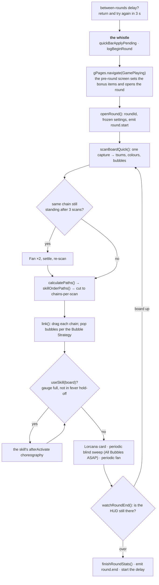

# Play loop

`taskPlayGameQuick` in `play.ts` is one round: the between-rounds delay, the
walk to the board, then **scan, link, skill** until the board stops answering.
The board itself — the scan, the chains, the bubbles — is `board.ts`; the
chain planning is `pathfinding.ts`; the skills are `skills/`.



## The walk in

The task returns early while a between-rounds delay is running, so the chores
keep their turns. Then comes **the whistle** — the last moment a setting can
still shape this round: settings held back by the Quick Bar land
(`quickBarApplyPending`), a new `roundId` opens, and `gPages.navigate` walks to
the board. On the way, the pre-round screen's handler sets the bonus items and
calls `openRound()`, which mints the round's id, freezes a copy of the settings
it is played under (`roundSettings`) and broadcasts `round.start`.

```ts reference title="app.gap.Tsum/src/play.ts"
https://github.com/game-automation-platform/game-automation-scripts/blob/main/app.gap.Tsum/src/play.ts#L492-L551
```

## One turn of the loop

1. **Cap check.** If *Max round duration* is set and has elapsed, either stop
   the script or *coast*: stop playing and keep only the liveness check, so the
   round times out on its own and the tally, the stats and the next round
   follow as usual. A coast has no deadline — it watches until the game over
   screen, however long that takes, logging `play.roundCoasting` once a minute.
   The game's Pause is never pressed here — it would stop the very clock the
   round has to run down.
2. **Scan.** `scanBoardQuick()` takes one capture and reads the tsums (circle
   detection, colour clustering) and the bubbles off it.
3. **Stall check.** A chain the game refused leaves the board exactly as it
   was, so the next scan plans the same chain and draws it again. The loop
   remembers the chain it drew; if it is still standing after enough scans, two
   Fan taps shake the board loose. This is the "same few tsums lit up over and
   over with nothing clearing" case, and `board.stalled` in the log is its
   fingerprint.
4. **Plan.** `calculatePaths` finds the longest chain per colour component
   under the chain cap (the *Maximum Chain Number* setting unless the skill
   overrides it through `chainLimits`); `skillOrderPaths` lets a skill reorder
   them (Formal Beast picks by colour to keep his twin gauge level); then the
   list is cut to *chains per scan*.
5. **Link.** `link()` drags each chain as a touch-down, a run of moves and a
   touch-up. The 10/10/10 ms drag timing is load-bearing: the game drops
   tsums out of a chain drawn too fast. Bubbles are spent inside chains
   according to the **Bubble Strategy** — a bubble popped while a chain is
   clearing takes a bigger area with it, so the loop hoards them and
   `bubbleTapBudget` says how many a chain may pop.
6. **Skill.** `while (useSkill(board))`: the shared core checks the gauge,
   respects the fever hold-off, taps the button and hands over to the skill's
   choreography ([Add a skill](../guides/add-a-skill)). A skill that turns
   tsums into bubbles sweeps them itself and says so with `sweepsBubbles`.
7. **Extras.** Tap the Lorcana card if it is up; run the blind bubble sweep if
   the strategy is *All Bubbles ASAP* and no skill has a standing claim on the
   bubbles; use the Fan every fourth turn if the setting is on and the gauge is
   not about to fill anyway.
8. **Liveness.** `watchRoundEnd` asks whether the HUD is still there. A burst
   skill's animation covers the same pixels, so an unreadable frame is played
   through a few times before the loop concludes the round is over — only a
   page a round can genuinely end on, or `confirmGameOver`'s grace window,
   proves it.

## The end

On the turn the round is proven over, `watchRoundEnd` stamps `roundEndedAt` and
broadcasts `round.over`. The loop exits, `finishRoundStats` reads the score
page (template digit reading — the engine has no OCR) and writes the CSV row,
`round.end` goes out with the figures, and if a delay is configured the clock
for the next round starts from the game being back at the start screen.

<ImagePlaceholder id="board-chain-drawn" alt="The game board during a round, with one planned chain drawn over the tsums it links" />

<ImagePlaceholder id="skill-button-gauge" alt="The skill button in its three states: gauge filling, full, and the Lorcana medallion" />

<ImagePlaceholder id="score-page" alt="The post-round score page with the score, coins and medals the stats reader picks up" />

## Modes of the board

Two things change how a round is played without being screens:

- **Fever.** `fever.ts` reads it off its own probe table, debounces the
  answer and broadcasts start/end to subscribers (`gFever.subscribe`). The
  *No skill last fever seconds* setting is the hold-off `useSkill` honours.
- **The Lorcana transformation.** `lorcana.ts` reads the skill button (a
  gold-rimmed medallion until the transformation, the ordinary button after)
  with hysteresis each way, taps the card when it appears, and pops the ink
  stone bubble each activation leaves. It is a setting rather than a skill,
  because every Lorcana tsum transforms the same way whatever its skill does.

## Reading a round afterwards

Every record in the round carries its `roundId`; `round.start` … `round.end`
carry the same `id`. The stats CSV (`tsum_record/stats_<YYYYMMDD>.csv`) has
one row per round with the settings it was played under, read from the frozen
`roundSettings` copy — so a Quick Bar change made mid-round is written on the
*next* round's row, not this one's.
