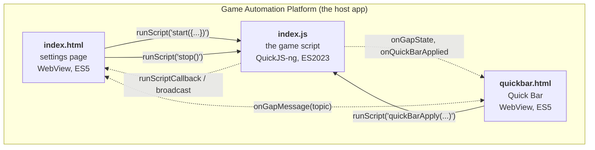

# Three worlds

The script folder holds three programs, and they never share memory.

- The **settings page** is `index.html` with `settings.ts` inlined into it.
  When you press Play it reads its controls into one object and evaluates
  `start({ autoLaunchApp: true, skillType: 'burst', ... })` in the engine.
- The **Quick Bar** is `quickbar.html` with `quickbarPage.ts`, a strip of live
  controls the host draws along the bottom of the screen during a run.
- The **game script** is `index.js`, the concatenated bundle. It runs on the
  app's embedded QuickJS-ng engine and is the only one of the three that can
  see the screen or tap it.

The only channel between them is `JavaScriptInterface.runScript(<source
string>)` — a page hands the engine a string to evaluate. That is why `start()`
receives its whole configuration as one JSON-serialised argument rather than
reading it from anywhere, and why the pages and the engine can only share
things that exist at compile time: `const enum`s from `shared.d.ts` are inlined
into each compilation, so `SettingKey`, `SkillType` and friends are one list
across all three without any runtime object being duplicated.

## Play, Stop, and the settings panel

- **Play** with the panel open always means "start with these settings", from
  whatever is on screen at the time. `start()` winds down a run that is already
  going before it builds the new one.
- **Stop** calls `stop()`, which asks the run to end and waits for it to say it
  has. Tasks are cooperative, so a round already in progress plays on until its
  loop notices.
- **Opening the settings panel pauses the run** rather than stopping it. The
  host parks `sleep()` and every touch injector, so the script cannot tap the
  panel drawn over the game; closing the panel resumes exactly where it was.
  If a round is running, the pause also presses the game's own Pause button
  (`onPause()` in `quickbar.ts`) so the round's clock stops too.

## The pages run in an overlay, which costs two browser habits

The host shows the pages in a WebView inside an Android overlay window owned by
a Service. There is no Activity behind it and no URL of its own, and both take
something away:

- **No native popup can open.** A `<select>` renders and then does nothing at
  all when tapped — no error, nothing in the log. So `settings.ts` builds its
  dropdowns out of a button and a list (`buildSelect`). The same goes for
  `alert`, `confirm` and any other native picker: do not add one.
- **`location.reload()` navigates away**, because the document's base URL is
  the script directory. Anything that wants the page redrawn calls
  `renderPage()` instead, which is safe at any time because every row keeps its
  live value in the schema (`setting.default`).

Two more things follow from `file://`: the page is not a secure context, so
there is no `navigator.clipboard` (the host provides
`JavaScriptInterface.setClipboard` / `getClipboard`, feature-detected), and
nothing may be fetched — Pico CSS is copied out of `node_modules` and inlined
at build time, never loaded from a CDN.

<ImagePlaceholder id="settings-tabs-general" alt="The settings page open on the General tab, with the Run order card at the top and the light/dark toggle in the app bar" />

<ImagePlaceholder id="quick-bar-strip" alt="The Quick Bar strip along the bottom edge of the game: Skill, Lv, Scan, Chain, +Coin, 5>4, Preset, Bubble and Report chips, with the coin averages on the right" />

## Two threads

`start()` does not return while the script runs: it hands control to the task
loop. So **every `stop()` runs on a second thread while `start()` is still on
the stack.** The host dispatches each `runScript` on its own pool thread, and
the engine hands the interpreter lock over at every `sleep()`, so the two
interleave at every sleep boundary.

The rule that keeps them from fighting over the world: **a run dismantles its
own world.** `stop()` only sets `ts.isRunning = false`, drains the scheduler
and waits (up to 20 s) for the run to report it has finished; the run tears
down in `start()`'s `finally`, through `endRun()`. The previous design cleared
`ts` from inside `stop()`, which pulled the world out from under a task that was
still using it — see [Run lifecycle](run-lifecycle).

## How the three stay in step

While a run is on, a setting is written down in three places: the settings
form, the world the script is playing under, and the Quick Bar's strip. They
are kept as one through the running world, which both pages can read:
[Settings model](settings-model) is the whole story.
